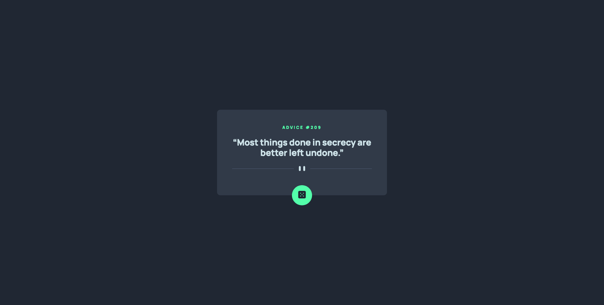

# Frontend Mentor - Advice generator app solution

This is a solution to the [Advice generator app challenge on Frontend Mentor](https://www.frontendmentor.io/challenges/advice-generator-app-QdUG-13db). Frontend Mentor challenges help you improve your coding skills by building realistic projects.

## Table of contents

- [Overview](#overview)
  - [The challenge](#the-challenge)
  - [Screenshot](#screenshot)
  - [Links](#links)
- [My process](#my-process)
  - [Built with](#built-with)

## Overview

### The challenge

Users should be able to:

- Generate random advice by pressing the button

### Screenshot

### Links

- [Code](https://github.com/waldekglaz/Advice-Generator)
- [Live](https://waldekglaz.github.io/Advice-Generator/)

## My process

### Built with

- [Advice Slip API](https://api.adviceslip.com/)
- Semantic HTML5 markup
- CSS custom properties
- Flexbox
- Mobile-first workflow
